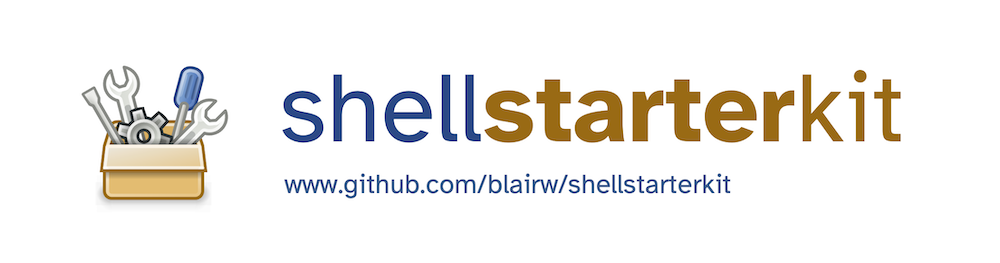

Starter kit for Unix terminal, Python, etc.

- Terminal and package manager setup ([Mac](01-terminal-setup-mac.md), [Windows](01-terminal-setup-win.md))
- [UNIX-based command line basics](02-unix-basics.md)
- [Python environment setup](03-python-setup.md)

Walkthrough videos:

- For Mac: https://www.youtube.com/watch?v=yW-1HbSlLTc
  - ✅ Good news - the Mac version includes the installation of Visual Studio Code.
- For Windows: https://www.youtube.com/watch?v=NlbHa49IiGc
  - ⚠️ Please ensure you install Visual Studio Code from Microsoft before using these instructions: https://code.visualstudio.com/
